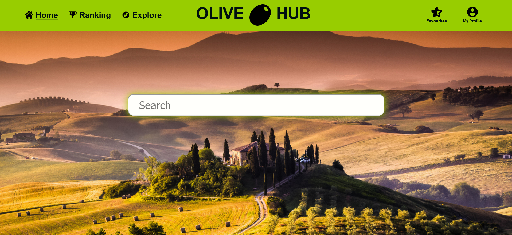

<br />
<div align="center">
  <a href="https://github.com/ptrmad/OliveHub">
    
  </a>
</div>

<h3 align="center">OliveHub - Discover, Learn, and Enjoy the World of Olive Oil</h3>

<p align="center">
  A React-based webpage designed to be a one-stop shop for olive oil enthusiasts.
</p>

## About The Project

OliveHub is a comprehensive webpage designed for anyone who loves olive oil! Whether you're a seasoned connoisseur or just starting to explore the world of extra virgin olive oil (EVOO), OliveHub offers a wealth of information, resources, and tools to help you:

- **Discover:** Explore different types of olive oil, their origins, and flavor profiles.
- **Learn:** Gain insights into the production process, health benefits, and proper storage techniques.
- **Enjoy:** Find recipes, pairing recommendations, and tips for incorporating olive oil into your everyday cooking.

<div align="center">
  
</div>

### Built With

- **React (v19 beta):** A JavaScript library for building user interfaces.
- **React Features:**
  - State Management
  - Context API
  - Hooks (including the `use` feature from React 19 beta)
- **React Router DOM:** A library for handling routing in React applications.
- **CSS Modules:** A technique for managing CSS styles within React components.
- **Vite:** A lightning-fast development server and bundler.

<p align="right">(<a href="#readme-top">back to top</a>)</p>

## Getting Started

This section guides you through setting up OliveHub for local development.

### Prerequisites

You'll need Node.js and npm (Node Package Manager) installed on your system. You can download and install them from the official Node.js website (https://nodejs.org/en).

**Optional:**

- A code editor or IDE of your choice (e.g., Visual Studio Code, WebStorm) for a more streamlined development experience.

### Installation

1. Clone the Repository

   ```bash
   git clone [https://github.com/ptrmad/OliveHub.git](https://github.com/ptrmad/OliveHub.git)
   ```

2. Install NPM packages
   ````sh
   npm install
   ```
   ````
3. Install react
   ```sh
   npm install react@beta react-dom@beta
   ```

### Developer Server

1. Navigate to the project directory

   ```sh
   cd  OliveHub
   ```

   2. Run developer server

   ```sh
   npm run dev
   ```

This will start the development server and open OliveHub in your web browser, typically at http://localhost:5173/.

<p align="right">(<a href="#readme-top">back to top</a>)</p>

## Usage

OliveHub is designed to help users find and read reviews of the best olive oils. Here are some examples of how you can use OliveHub:

### Example 1: Searching for Olive Oils

Use the search bar at the top of the homepage to find specific olive oils. Simply type in the name of the olive oil you are looking for, and OliveHub will display matching results. You can also go to /explore - there you'll find reused

```jsx
<SearchBar />
```

component and all the olive oils in database. Searchbar is working based on the react context mechanism.

  

### Example 2: Adding Olive Oils to Favourites

Users can easily add their preferred olive oils to their favourites list. This feature allows users to quickly access their favourite olive oils for future reference. User can easily access their favourite olive oils by going to the separate /favourites subpage, and there manage their list. User can add item to favourites from the view of single olive oil review and it's done with help of context mechanism.

```jsx
<Favourites />
```

### Example 3: Viewing Rankings

OliveHub provides a ranking of the best olive oils based on user ratings. You can view the top-rated olive oils and see their details.

```jsx
<Ranking />
```
